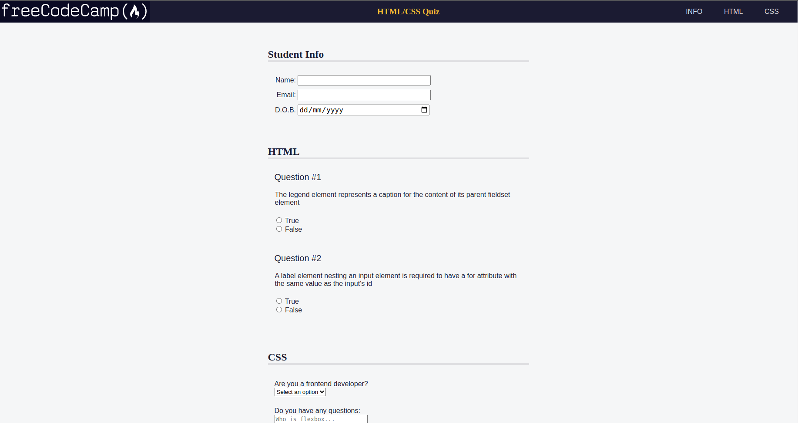

Accessibility Quiz
This is a practice project for an accessibility quiz, developed as part of freeCodeCamp. The quiz covers HTML and CSS topics. Users can enter their information, answer questions, and submit the form.

Project Structure
index.html: The main HTML file that contains the structure and content of the quiz.
styles.css: The CSS file that defines the styles for the quiz.
README.md: This file, providing information about the project.
Usage
Open the index.html file in a web browser.
Fill in the student information section.
Answer the HTML and CSS questions.
Select your choice for the "Are you a frontend developer?" question.
Enter any additional questions in the "Do you have any questions?" textarea.
Click the "Send" button to submit the form.
Accessibility Features
The accesskey attribute is used to assign keyboard shortcuts to navigation links (INFO, HTML, CSS).
The form inputs are labeled using the <label> element, which improves accessibility and allows users to associate labels with their corresponding input fields.
The aria-labelledby attribute is used to associate section headings with their corresponding sections, providing additional context for screen readers.
The role attribute is used to define regions (<section>) within the document, which helps screen readers understand the structure of the content.
The aria-describedby attribute is used to provide descriptions for certain elements, such as the "D.O.B." label.
The aria-hidden attribute is not explicitly used in the provided code, but it's an important attribute for hiding elements from assistive technologies when necessary.
Styling
The project includes a styles.css file with CSS rules for styling the quiz. The styles define the appearance of the header, navigation, form, questions, inputs, and buttons.

Compatibility
The project is designed to be compatible with modern web browsers and follows best practices for web accessibility. However, it's always recommended to test the project across different browsers and assistive technologies to ensure optimal accessibility and usability.

That's a brief overview of the Accessibility Quiz project. Feel free to explore the code and make any necessary modifications or improvements.